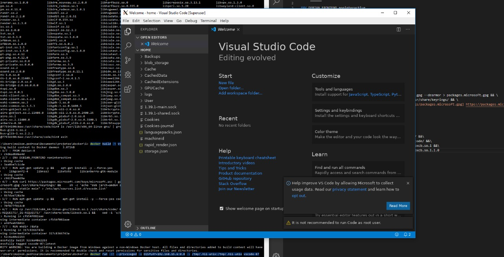

# Dockerized Visual Studio Code with GUI

## Getting Started

```docker
docker pull maikoncanuto/vscode:0.0.1
```



To start the container with graphical display in windows, you will need to download the Xming program. Linux operating systems do not need third party programs for emulating the graphical interface.

### Prerequisites

#### Windows X11 Server
* [Xming](https://sourceforge.net/projects/xming/)

#### Configuration X11 Server (Windows)
After downloading the X11 server, configure as indicated.

Note: Linux-based operating system does not need to perform x11 configuration

* Configure Xming X Server `x0.hosts` file with your IP ADRESS. 

```powershell
localhost
<your_ip_local> 
```

Note: default location is `C:\Program Files (x86)\Xming\x0.hosts`

* Open a `Powershell` command prompt. 

* Set the DISPLAY environment variable
```powershell
PS > set-variable -name DISPLAY -value <your_ip_local>:0.0
```

### Docker Run (Windows and Linux)
```powershell
PS > docker run -it --privileged -e DISPLAY=$DISPLAY -v  /tmp/.X11-unix:/tmp/.X11-unix maikoncanuto/vscode:0.0.1
```
